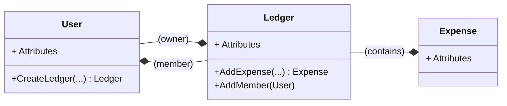

In this post, you will learn about the foundational principles and goals of Domain Driven Design (DDD).
The concepts and approaches described are heavily biased towards my own experience with DDD, reflecting my particular interpretation.
DDD promotes a layered architecture (e.g., Domain, Application, Infrastructure, Presentation/UI). While the core business logic resides in the Domain Layer.

## What is Domain Driven Design?

In my own words (without directly quoting external sources), DDD is the methodology of focusing on business processes more than on their technical counterparts.
Usually, when you start programming a new application, the main spotlight is always on the data and how to structure it.
With DDD, you first want to model what processes are defined, and what these processes entail.
So, you always start DDD not focused on code, but on how your entities will behave.

The domain is the central piece; it's not reliant on any technology or technical concepts. It doesn't know databases; it doesn't know transactions.
To have a clean domain, you need to define a non-technical vocabulary for your "Ubiquitous Language."

Example of a very simple domain for a financial ledger:

### Example

<center>



</center>

## Domain

So let's write a domain layer for this example:

```go
package domain

type (
    User struct {
        ID int
    }

    Expense struct {
        ID int
        LedgerID int
    }

    Ledger struct {
        ID int
        Owner int
        Members []int
        Expenses []Expense
    }
)

func NewUser(id int) User {
    return User{ ID: id }
}

func (u User) CreateLedger() Ledger {
    return Ledger{
        Owner: u.ID,
        Members: []LedgerMember{u.ID},
    }
}

func (l *Ledger) AddExpense() Expense {
    expense := Expense{
        ID: 1,
        LedgerID: l.ID,
    }

    l.Expenses = append(l.Expenses, expense)

    return expense
}

func (l *Ledger) AddMember(u User) {
    l.Members = append(l.Members, u.ID)
}
```

In this example, all our modeled processes occur in memory; we have a state machine controlling all possible transitions.
This is initially trivial when the cardinality of your entities is not high. But if you start to consider, for example, that the Ledger might have millions of entries,
you might want to decouple the Ledger from the Expenses.

### Example for high cardinality

Let's imagine an example where the ledger still has some control over expenses, while not loading millions of rows into memory.

```go
// previous code

type Ledger struct {
    ID int
    Owner int
    Members []LedgerMember
    ExpensesCount int
}

const MaxLedgerExpenses = 100_000_000

func (l *Ledger) AddExpense() (*Expense, error) {
    if l.ExpensesCount+1 > MaxLedgerExpenses {
        return nil, fmt.Errorf("expense count exceeded")
    }

    expense := &Expense{
        ID: 1,
        LedgerID: l.ID,
    }

    l.ExpensesCount++

    return expense, nil
}

// further code
```

With this change, now you don't have to load expenses into memory, and can selectively control any given expenses from the domain.
There is only one potential problem: 

* How do we keep transactional consistency when an operation spans multiple objects or updates an aggregate and its related data?

## Application and Transactionality

Now, moving further into our application, we consider that we have the previous domain implemented.
The Ledger entity acts as a controller for the expenses, and it has a count for its expenses.

If we consider that multiple expenses can be created in parallel, we want to avoid loading dirty states or having race conditions on these entities.
What I normally do is use the ledger as a lock, inside a database transaction.

### Postgres lock example

If you consider PostgreSQL, for example, you can lock the ledger row with:

```sql
SELECT * FROM ledgers WHERE id = $1 FOR UPDATE;
```

Bringing the transaction into the application layer, you ensure that there are no other queries mutating the state while the domain operations are happening.
Let's introduce a transaction in the Application layer:

```go
package application

type (
    Database interface {
        Transaction(context.Context, func(Database) error) error
        LedgerRepository() LedgerRepository
        ExpenseRepository() ExpenseRepository
    }

    LedgerRepository interface {
        Load(context.Context, int) *domain.Ledger
        Save(context.Context, *domain.Ledger)
    }

    ExpenseRepository interface {
        Load(context.Context, int) *domain.Expense
        Save(context.Context, *domain.Expense)
    }
)

// Application definition...

func (a Application) CreateExpense(ctx context.Context, req CreateExpenseRequest) error {
    return a.db.Transaction(ctx, func(db Database) error {
        ledger := db.LedgerRepository().Load(ctx, req.LedgerID)

        expense, err := ledger.AddExpense()
        if err != nil {
            return err
        }

        if err := db.LedgerRepository().Save(ctx, ledger); err != nil {
            return err
        }

        return db.ExpenseRepository().Save(ctx, expense)
    })
}
```

With this approach, you have transactionality, meaning you either complete the domain operations or none of them are applied (they are rolled back), while fully controlling the state from the domain layer.
The application layer is still unaware of database-specific infrastructure, only having the concept of a transactional database.

## Conclusion

Let me know your thoughts; send me an [email](mailto:me@sonalys.dev) and let's talk.