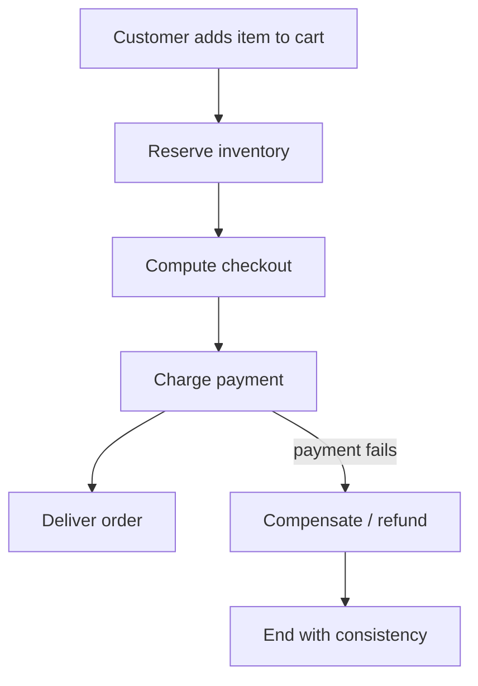
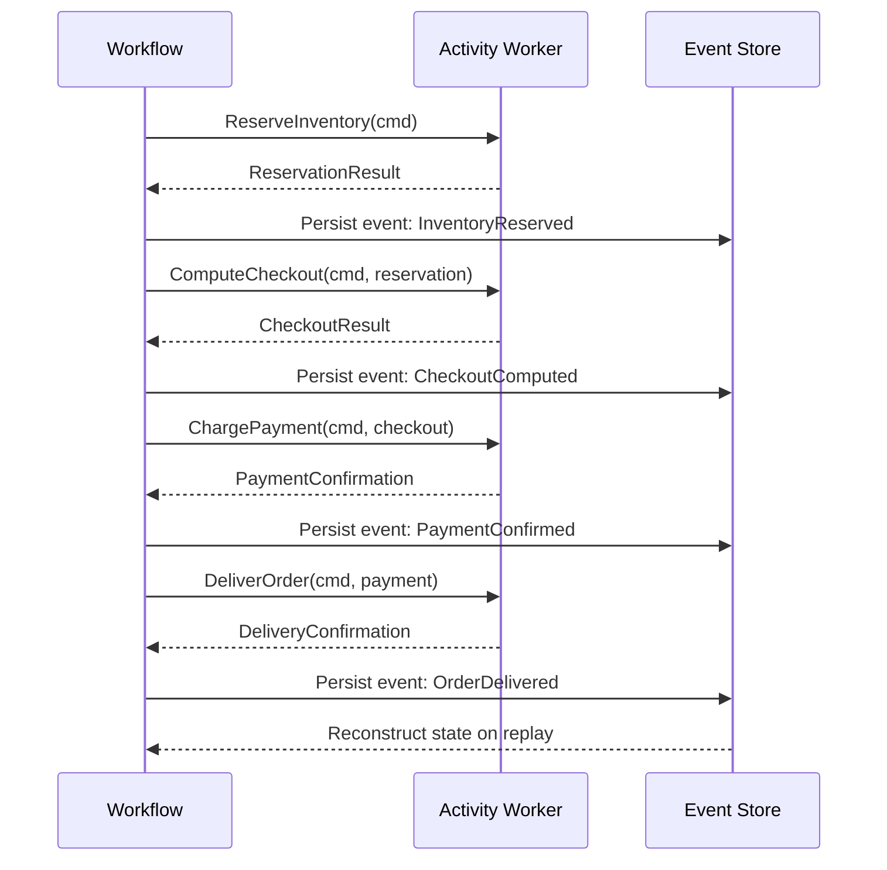
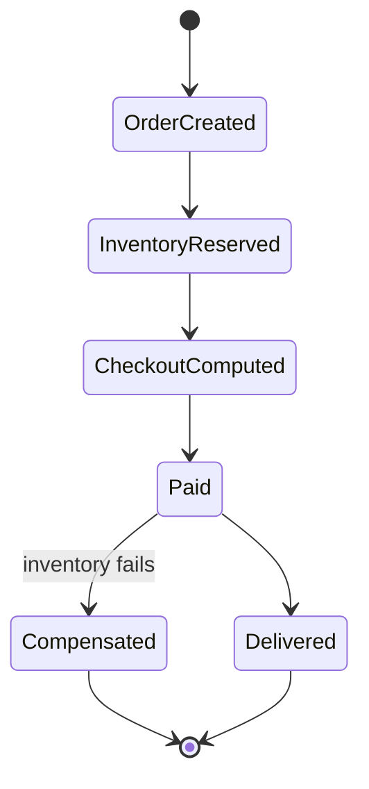
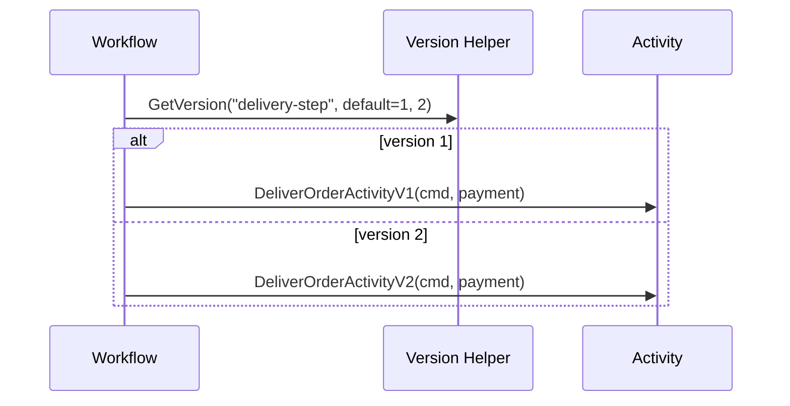

Here you will be briefly introduced to the basic concepts around Durable Workflow Execution.
I will go through the problem, the proposed solution, and a basic Go implementation and framework recommendations.

## What is Durable Execution?

When developing cloud native services, we must be aware about the ephemeral nature of the services we are developing.  
Services can and will be killed within a grace period of usually around 15 seconds.  
This concept is very important for the backend developer to be aware of and to implement graceful shutdown mechanisms that improve data integrity.

Durable Execution refers to long-lived processes that:
* Will live longer than the termination grace period
* Requires a deterministic/idempotent behavior

### Example

When dealing with a shopping cart, there are many individual steps that need to be considered. The process cannot simply stop after a service is shut down.
* Customer adds an item to the shopping cart
* Item is reserved for a time period in inventory
* Checkout service applies taxes and discounts
* Payment processor handles the payment transaction
* The checkout items are marked for delivery in the inventory system

This is, of course, a very trivial, simplified and heavily focused on the happy path. Many things can and will go wrong with this process.
The focus here are on two main aspects:
* The process cannot end in an inconsistent state
* When things go wrong, we need to compensate to keep the state consistent

We do not want to leave the order in limbo after payment.
We want to refund payment if inventory cannot mark the items for delivery.



## Transactional Boundaries

Each step listed before must be idempotent units-of-work. You must design your API in a way that any step running again will not cause side-effects. This is required for keeping the state consistent.  
If the system receives an event twice, let's say, about the item being reserved for the checkout, the system must not error the second handling, because the reservation was already made for this flow. Erroring it would mean the reservation is already there but the system cannot proceed.

Idempotency is required because we are not in a single transactional boundary. You cannot ensure that everything either happens or does not happen consistently.

Even if an API call succeeds for processing a payment, the durable workflow engine might not register it, resulting in a retry and at-least-once processing, thus the need for idempotency.

## The controller and the state machine

Now the controller enters.  
The main idea is simple: the controller should ensure a few things:
* The state of the process remains integral, no inconsistent or undesirable states
    * Example A: Redeployments do not prevent an item from being set to delivery when payment finishes
    * Example B: Payment gets refunded in case inventory system fails to process delivery request
* The reconstructed state must be deterministic
    * The durable workflow execution must not have side-effects if the state is reconstructed under different conditions, like time or randomness
    * The controller's logic must always converge to the same outcomes; a change in code must not diverge the state of existing processes
* The controller can always reconstruct the process from a database or event ledger
    * The process state must be transactional; a single transactional boundary is required to maintain integrity

### Integrity

Integrity is essential, as the process state acts as a source of truth. If your process can fork directions based on an external, mutable condition, you must ensure that you have a single source of truth for what happened.

#### Example
You have to choose whether the order uses the inventory from warehouse A or B, you must ensure that as soon as the process chooses A, you do not allow it to also choose B.

This can happen either as:
* The step for selecting a warehouse failed to register in the process state, but the request was successful
* Race-condition allowing two concurrent writes to the same process

To avoid these types of problems, it's ideal to ensure that your steps are as atomic as possible, separating a choice from the execution of the choice would help prevent this scenario. Example:
* A step for selecting whether you use warehouse A or B
* A step for calling the selected warehouse

By splitting the process into 2 distinct atoms, you ensure stronger integrity within your system, because the act of choosing which warehouse you will use will not cause side-effects.

For race conditions, the solution is to have a mutex or lock for only allowing linear write operations.

### State reconstruction
Since we are dealing with ephemeral services, we cannot control when the controller will lose the state.
It's essential that we have an underlying database capable of storing and recovering the state.



To me, the best choice is to use event sourcing, since it provides auditing and great visibility of the process as a whole.  
Event sourcing would mean that every atomic operation, or step, that happens, is registered as an event.  
This event ledger can be used to reconstruct the exact latest state of the process.

#### Example

1. Item added to shopping cart: `{type: cartItemAdded, item: { id, quantity, price, ...}}`
2. Inventory reserved items: `{type: inventoryItemReserved, item: {id, quantity, ...}}`
3. Checkout computed: `{type: checkoutComputed, checkout: { id, subTotal, taxes, total, ...}}`
4. etc.



From this list of events we should notice two things:
* Events record steps that already happened
* We bring external mutable values into an immutable and idempotent event ledger
    * Note on item price and taxes, which are external mutable factors


### Determinism

If the shopping cart item was added a month ago, when we reconstruct the events, we use the stored price from one month ago.
We cannot rely on external mutable factors, since we lose determinism and the decisions / logic embedded within the workflow would fork.  
So it's essential that we only have mutability and randomness within the execution of the steps themselves, all input and output should be deterministic.

I myself was always tempted to see only data as a source of mutation, but do not forget that the controller's logic itself could mutate the state of existing processes. We must avoid this at all costs. So, how should we deal with this invisible problem?
* Implement tests that ensure that a sequence of events always converges to the same state
* Implement versioning mechanisms

#### Versioning

To ensure we keep the state immutable from the controller itself, we can do 2 things:
* Version the workflow as a whole, meaning newer executions will run on newer code
* Version the steps, meaning that if a step was not yet executed within a workflow, using a newer function logic would not cause mutations

For versioning the workflow, it's simpler. You just store the workflow version on creation, and select the appropriate workflow function to handle that specific version.  
For versioning steps, it's more complicated. You need to annotate which version a step is executing and select the appropriate step function handler. But how do you know the version you are using before running the step?  

Certain frameworks, like Temporal.io, use a helper step function to grab the version to be used. They check the event ledger on whether a version is registered.

1. Helper function is called to check for which version to use
2. The helper function checks whether it's the latest event in the ledger, if yes, it sets the version in the ledger for future replays
3. If the helper function is not the latest event, it will know it's using a previously unversioned step and defaults to the minimum version

This allows the steps to retroactively be versioned, keeping determinism and introducing new step versions when they weren't executed yet.



In the example below, the workflow function orchestrates the process and each step is implemented as a separate activity function. Each activity receives the previous step's output and returns a typed state object.

### Mock Example in Go

```go
package example

import (
    "context"
    "fmt"
    "time"

    "go.temporal.io/sdk/workflow"
)

// OrderCommand is the serializable workflow input.
type OrderCommand struct {
    OrderID string `json:"orderID"`
    SKU     string `json:"sku"`
    Qty     int    `json:"qty"`
    Amount  int    `json:"amount"`
}

type CartItem struct {
    SKU string `json:"sku"`
    Qty int    `json:"qty"`
}

type Reservation struct {
    Warehouse string `json:"warehouse"`
    Reserved  bool   `json:"reserved"`
}

type CheckoutResult struct {
    Subtotal int `json:"subtotal"`
    Taxes    int `json:"taxes"`
    Total    int `json:"total"`
}

type PaymentConfirmation struct {
    TransactionID string `json:"transactionID"`
    Paid          bool   `json:"paid"`
}

type DeliveryConfirmation struct {
    TrackingID string `json:"trackingID"`
    Delivered  bool   `json:"delivered"`
}

func OrderWorkflow(ctx workflow.Context, cmd OrderCommand) error {
    ao := workflow.ActivityOptions{StartToCloseTimeout: time.Minute}
    ctx = workflow.WithActivityOptions(ctx, ao)

    // 1. Add item to the cart.
    var item CartItem
    if err := workflow.ExecuteActivity(ctx, AddItemToCartActivity, cmd).Get(ctx, &item); err != nil {
        return err
    }

    // 2. Reserve inventory for the order.
    var reservation Reservation
    if err := workflow.ExecuteActivity(ctx, ReserveInventoryActivity, cmd, item).Get(ctx, &reservation); err != nil {
        return err
    }

    // 3. Compute checkout details deterministically.
    var checkout CheckoutResult
    if err := workflow.ExecuteActivity(ctx, ComputeCheckoutActivity, cmd, reservation).Get(ctx, &checkout); err != nil {
        return err
    }

    // 4. Charge payment.
    var payment PaymentConfirmation
    if err := workflow.ExecuteActivity(ctx, ChargePaymentActivity, cmd, checkout).Get(ctx, &payment); err != nil {
        return err
    }

    // 5. Deliver order with versioned step.
    version := workflow.GetVersion(ctx, "delivery-step", workflow.DefaultVersion, 2)
    switch version {
    case 2:
        var delivery DeliveryConfirmation
        if err := workflow.ExecuteActivity(ctx, DeliverOrderActivityV2, cmd, payment).Get(ctx, &delivery); err != nil {
            return err
        }
        fmt.Printf("Delivery completed with tracking %s\n", delivery.TrackingID)
    default:
        var delivery DeliveryConfirmation
        if err := workflow.ExecuteActivity(ctx, DeliverOrderActivityV1, cmd, payment).Get(ctx, &delivery); err != nil {
            return err
        }
        fmt.Printf("Delivery completed with tracking %s\n", delivery.TrackingID)
    }

    return nil
}

func AddItemToCartActivity(ctx context.Context, cmd OrderCommand) (CartItem, error) {
    item := CartItem{SKU: cmd.SKU, Qty: cmd.Qty}
    fmt.Printf("1. Adding item %s (qty=%d) to cart for order %s\n", item.SKU, item.Qty, cmd.OrderID)
    return item, nil
}

func ReserveInventoryActivity(ctx context.Context, cmd OrderCommand, item CartItem) (Reservation, error) {
    reservation := Reservation{Warehouse: "WH-1", Reserved: true}
    fmt.Printf("2. Reserving inventory for %s (qty=%d) in warehouse %s\n", item.SKU, item.Qty, reservation.Warehouse)
    return reservation, nil
}

func ComputeCheckoutActivity(ctx context.Context, cmd OrderCommand, reservation Reservation) (CheckoutResult, error) {
    checkout := CheckoutResult{Subtotal: cmd.Amount, Taxes: cmd.Amount / 10, Total: cmd.Amount + cmd.Amount/10}
    fmt.Printf("3. Computing checkout for order %s: subtotal=%d, taxes=%d, total=%d\n", cmd.OrderID, checkout.Subtotal, checkout.Taxes, checkout.Total)
    return checkout, nil
}

func ChargePaymentActivity(ctx context.Context, cmd OrderCommand, checkout CheckoutResult) (PaymentConfirmation, error) {
    payment := PaymentConfirmation{TransactionID: "txn-123", Paid: true}
    fmt.Printf("4. Charging payment for order %s: total=%d\n", cmd.OrderID, checkout.Total)
    return payment, nil
}

func DeliverOrderActivityV1(ctx context.Context, cmd OrderCommand, payment PaymentConfirmation) (DeliveryConfirmation, error) {
    delivery := DeliveryConfirmation{TrackingID: "TRACK-V1-001", Delivered: true}
    fmt.Printf("5. Scheduling delivery for order %s using V1, transaction %s\n", cmd.OrderID, payment.TransactionID)
    return delivery, nil
}

func DeliverOrderActivityV2(ctx context.Context, cmd OrderCommand, payment PaymentConfirmation) (DeliveryConfirmation, error) {
    delivery := DeliveryConfirmation{TrackingID: "TRACK-V2-002", Delivered: true}
    fmt.Printf("5. Scheduling delivery for order %s using V2 with priority shipping, transaction %s\n", cmd.OrderID, payment.TransactionID)
    return delivery, nil
}
```

## Conclusion

Durable workflow execution is about making long-running processes resilient, consistent, and replayable. 

### References

* [Temporal.io](https://temporal.io/)
* [dbos](https://github.com/dbos-inc/dbos-transact-golang)

If you want to talk through a real implementation or compare tools and patterns for Go, send me an [email](mailto:me@sonalys.dev).